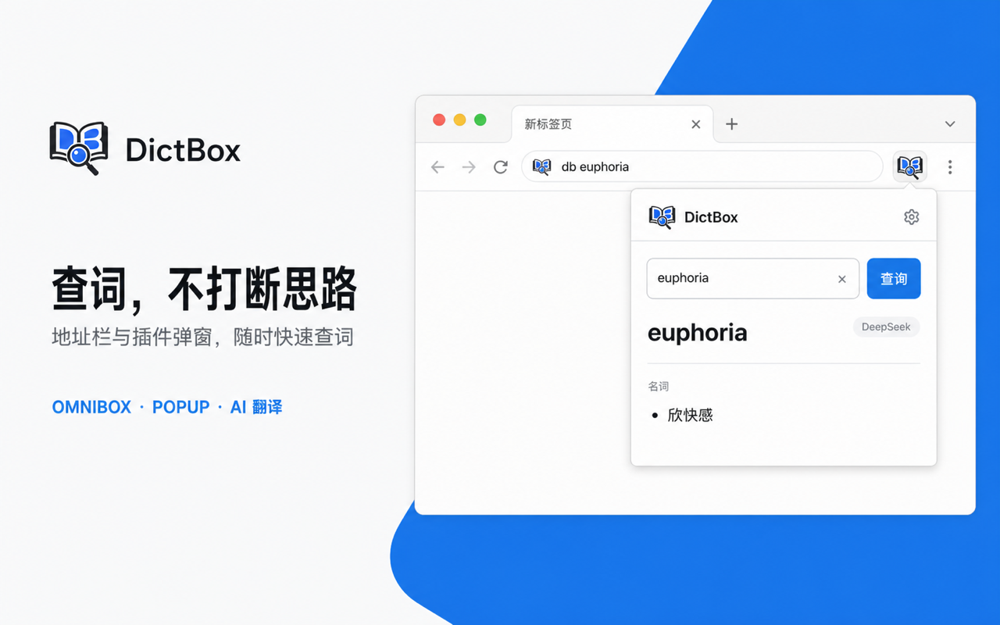
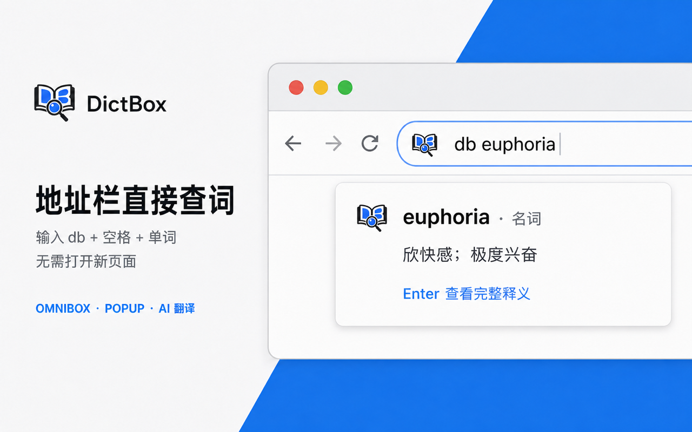
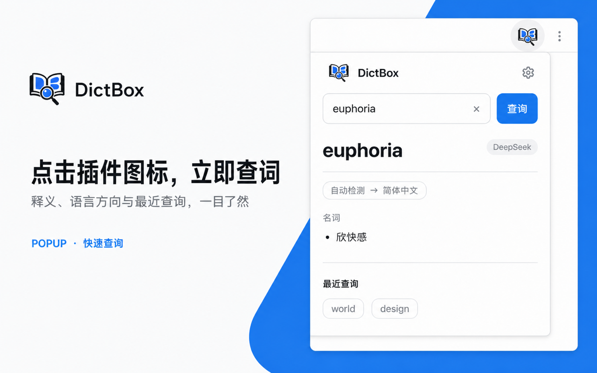

# DictBox V3

DictBox 是一个 Manifest V3 浏览器查词扩展。它支持 Chrome 地址栏快速查询、工具栏弹窗、扩展内部完整释义页以及本地设置和最近查询。

V3 默认使用无需 API Key 的免费查询服务，新用户安装后即可查词；也支持配置自己的模型 API 获取更丰富的词典结果。

## 界面预览

### 整体介绍



### Omnibox 地址栏查词



### 插件按钮查词



## 功能

- 地址栏输入 `db`，按空格或 Tab 后输入单词，显示精简释义。
- 按 Enter 打开扩展内部的完整释义页。
- 点击工具栏图标，在 380px 弹窗内查询、复制、清空及重试。
- 最近查询最多保留 5 条，仅保存在本地浏览器。
- 设置页支持免费查询、OpenAI、Gemini、Claude、DeepSeek 和 OpenAI 兼容的自定义服务商。
- API Key 存入 `storage.local`，普通设置存入 `storage.sync`。
- 自动检测查询语言；输入中文且目标为中文时会自动切换到英语。
- Chromium 与 Firefox 双目标构建。

## 本地开发

要求 Node.js 20 或更高版本。

```bash
npm test
npm run build:chromium
```

构建产物位于 `dist/chromium`。

在 Chrome 中打开 `chrome://extensions`：

1. 开启“开发者模式”。
2. 点击“加载已解压的扩展程序”。
3. 选择本仓库的 `dist/chromium` 目录。
4. 点击 DictBox 工具栏图标，无需配置即可查询 `world`。
5. 在地址栏输入 `db world`，确认建议出现并按 Enter 打开完整释义页。

源目录本身也包含完整 Manifest 和页面，但推荐加载构建产物，以验证实际发布内容。

## 常用命令

```bash
npm test             # 单元测试和 Chrome API 集成测试
npm run build        # 构建 Chromium 与 Firefox
npm run check        # 测试后构建两个目标
```

## 项目结构

```text
DictBox/
├── popup.html                  # 工具栏查词弹窗
├── result.html                 # 完整释义页
├── options.html                # 设置页
├── options.css                 # Open Design 视觉系统与页面样式
├── manifests/                  # 基础及浏览器差异 Manifest
├── src/
│   ├── background/             # Omnibox、消息路由、结果页跳转
│   ├── core/                   # 查询服务、结果规范化、展示模型
│   ├── infrastructure/         # 缓存、设置、最近查询
│   ├── popup/                  # 弹窗交互
│   ├── result/                 # 完整释义页交互
│   ├── options/                # 设置页交互
│   ├── providers/              # Mock 与真实服务商适配层
│   └── ui/                     # 安全 DOM 渲染
├── scripts/build.mjs
└── test/
```

## 免费查询与模型服务

- 新安装默认使用 MyMemory 免费查询，无需注册或填写 API Key。
- 模型服务需要 API Key，并可在高级设置中修改模型名称和 API 地址。
- 自定义服务只申请用户填写域名的最小主机权限。
- Mock Provider 仅保留给自动化测试，不在发布界面中提供开关。

## 安全与隐私

- 外部结果经过结构校验或规范化后才进入 UI。
- 结果通过 DOM `textContent` 渲染，不直接插入外部 HTML。
- API Key 默认遮罩，不进入 URL、日志或用户可见错误消息。
- DictBox 不提供账号或云端历史；最近查询仅保存在本地。
- 查询文本会发送到用户选择的服务商；API Key 仅保存在当前设备。

## 设计依据

V3 的弹窗、完整释义页、设置页、状态反馈和视觉令牌来自 Open Design 中的 `DictBox` 项目。实现对照记录见 [V3_IMPLEMENTATION.md](docs/V3_IMPLEMENTATION.md)。

## License

[MIT](LICENSE)
